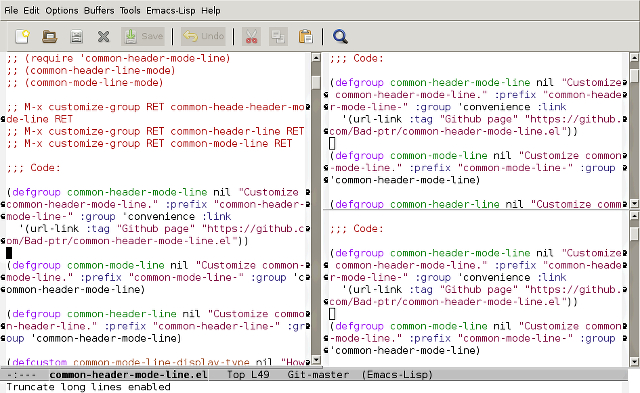
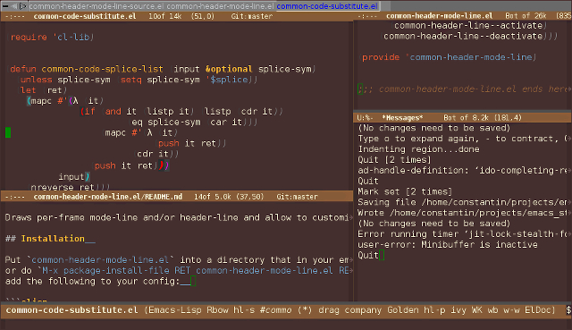

# common-header-mode-line  

## Copyright  

Copyright (C) 2025 Constantin Kulikov  

Author: Constantin Kulikov (Bad_ptr) <zxnotdead@gmail.com>  
Date: 2017/02/12 11:14:08  
License: GPL either version 3 or any later version  
Keywords: emacs, mode-line, header-line, convenience, frames, windows  
URL: http://github.com/Bad-ptr/common-header-mode-line.el  

## Intro  

Draws per-frame mode-line and/or header-line and allow to customize per-window header/mode-line.  

[](screenshots/emacs24Q.jpg)


## Installation  

```shell

    git clone git@github.com:Bad-ptr/common-header-mode-line.el.git
    cd common-header-mode-line.el
    make package

```

This will create a tar file in the `common-header-mode-line.el/pkg/` directory.  
Or you can download a [release](https://github.com/Bad-ptr/common-header-mode-line.el/releases).  

Then start emacs and `M-x package-install-file RET path/to/common-header-mode-line-{version}.tar RET`.  

Put the following into your emacs config:  

```elisp

    (with-eval-after-load "common-header-mode-line-autoloads"
      (common-mode-line-mode 1)
      (common-header-line-mode 1))

```

## How to use  

```elisp

M-x customize-group RET common-header-mode-line RET

M-x customize-group RET common-mode-line RET

M-x customize-group RET common-header-line RET

M-x customize-group RET per-window-header-mode-line RET

M-x customize-group RET per-window-mode-line RET

M-x customize-group RET per-window-header-line RET

M-x customize-group RET per-frame-header-mode-line RET

M-x customize-group RET per-frame-mode-line RET

M-x customize-group RET per-frame-header-line RET

```

Activating the `common-header-mode-line-mode` is equivalent to activating 
`common-header-line-mode` and `common-mode-line-mode`  which is equivalent to 
activating `per-frame-header-mode-line-mode` and `per-window-header-mode-line-mode` 
which is equivalent to activating `per-frame-header-line-mode`, `per-frame-mode-line-mode`, 
`per-window-header-line-mode` and `per-window-mode-line-mode`.  
You can enable/disable any subset of these minor-modes at any time. 
For example you can enable the `common-header-mode-line-mode` and then disable the `per-frame-header-line-mode`:  

```elisp

    (common-header-mode-line-mode 1)
    (per-frame-header-line-mode -1)

```

### Example configuration  

```elisp

    (with-eval-after-load "common-header-mode-line-autoloads"
      (add-hook
       'window-setup-hook
       (lambda ()
		 (common-header-mode-line-mode 1)

		 (dolist (frame (frame-list))
		   (set-frame-parameter frame 'bottom-divider-width 1)
		   (set-frame-parameter frame 'right-divider-width 1))

		 (push (cons 'bottom-divider-width 1) default-frame-alist)
		 (push (cons 'right-divider-width 1) default-frame-alist)

		 (let ((def-height (face-attribute 'default :height)))
		   (set-face-attribute
			'per-window-header-line-active-face nil
			:height (ceiling (max 1 (* 0.9 def-height))))

		   (set-face-attribute
			'per-window-header-line-inactive-face nil
			:height (floor (max 1 (* 0.7 def-height)))))

		 ;; (set-face-background
		 ;;  'per-window-header-line-active-face
		 ;;  (face-background 'mode-line))

		 ;; (set-face-background
		 ;;  'per-frame-header-line-inactive-face
		 ;;  (face-background 'mode-line-inactive))

		 ;; (customize-set-variable 'common-header-mode-line-update-delay 0.1)

		 ;; (customize-set-variable 'common-header-mode-line-delayed-update-register-timer-function
		 ;;                         #'run-with-timer)

		 ;; (customize-set-variable
		 ;;  'common-header-mode-line-delayed-update-on-hooks
		 ;;  (cons 'window-state-change-functions
		 ;;        (remove 'window-configuration-change-hook
		 ;;                common-header-mode-line-delayed-update-on-hooks)))

		 (setopt
		  common-header-mode-line-update-delay 0.1
		  common-header-mode-line-delayed-update-register-timer-function #'run-with-timera
		  common-header-mode-line-delayed-update-on-hooks
		  (cons 'window-state-change-functions
				(remove 'window-configuration-change-hook
						common-header-mode-line-delayed-update-on-hooks)))


		 (defvar per-window-header-line-active-format nil)
		 (defvar per-window-header-line-inactive-format nil)

		 (add-hook 'semantic-stickyfunc-mode-hook
				   (lambda ()
					 (if (and semantic-mode semantic-stickyfunc-mode)
						 (push semantic-stickyfunc-header-line-format
							   per-window-header-line-active-format)
					   (setq per-window-header-line-active-format
							 (delq semantic-stickyfunc-header-line-format
								   per-window-header-line-active-format)))))

		 (add-hook 'multiple-cursors-mode-hook
				   (lambda ()
					 (if multiple-cursors-mode
						 (add-to-list 'per-window-header-line-active-format
									  mc/mode-line)
					   (setq per-window-header-line-active-format
							 (delq mc/mode-line
								   per-window-header-line-active-format)))))

		 (setq per-window-header-line-format-function
			   (lambda (win)
				 (unless per-window-header-line-active-format
				   (setq per-window-header-line-active-format
						 `("" mode-line-front-space mode-line-mule-info
						   mode-line-modified
						   mode-line-remote " " mode-line-buffer-identification
						   " " mode-line-position (vc-mode vc-mode) " "
						   ;;" " ,(caddr mode-line-modes)
						   mode-line-misc-info mode-line-end-spaces)))
				 (unless per-window-header-line-inactive-format
				   (setq per-window-header-line-inactive-format
						 `("" mode-line-front-space mode-line-mule-info
						   mode-line-modified
						   mode-line-remote " " mode-line-buffer-identification
						   " " ,(caddr mode-line-position) (vc-mode vc-mode) " "
						   mode-line-misc-info mode-line-end-spaces)))
				 (let* ((buf (window-buffer win))
						(frmt (unless (or (string-prefix-p " " (buffer-name (window-buffer win)))
										  (with-current-buffer buf
											(derived-mode-p 'magit-mode))
										  ;; (and (boundp 'transient--window) (eq win transient--window))
										  ;; (and (boundp 'lv-wnd) (eq win lv-wnd))
										  )
								(if (eq (selected-window) win)
									per-window-header-line-active-format
								  per-window-header-line-inactive-format))))
				   (or frmt (buffer-local-value 'header-line-format buf)))))

		 (setq per-window-mode-line-format-function
			   (lambda (win)
				   (if (or (string-prefix-p " " (buffer-name (window-buffer win)))
						   ;; (and (boundp 'lv-wnd) (eq win lv-wnd))
						   ;; (and (boundp 'transient--window) (eq win transient--window))
						   )
					   mode-line-format
					 nil)))

		 (with-eval-after-load "eldoc"
		   (defun per-frame-mode-line-clear-eldoc-mode-line-string (&rest args)
			 (setq eldoc-mode-line-string nil))
		   (add-hook 'window-configuration-change-hook
					 #'per-frame-mode-line-clear-eldoc-mode-line-string)
		   (defun per-frame-mode-line-eldoc-minibuffer-message (format-string &rest args)
			 "Display message specified by FORMAT-STRING and ARGS on the mode-line as needed.
This function displays the message produced by formatting ARGS with FORMAT-STRING on the mode line."
			 (if per-frame-mode-line-mode
				 (progn
				   (with-current-buffer
					   (window-buffer
						(or (window-in-direction 'above (minibuffer-window))
							(minibuffer-selected-window)
							(get-largest-window)))
					 (when (and mode-line-format
								(not (and (listp mode-line-format)
										  (assq 'eldoc-mode-line-string mode-line-format))))
					   (setq mode-line-format
							 (list "" '(eldoc-mode-line-string
										(" " eldoc-mode-line-string " "))
								   mode-line-format)))
					 (setq eldoc-mode-line-string
						   (when (stringp format-string)
							 (apply #'format-message format-string args)))
					 (force-mode-line-update)))
			   (apply #'eldoc-minibuffer-message format-string args)))
		   (setq eldoc-message-function
				 #'per-frame-mode-line-eldoc-minibuffer-message))

		 (setq per-frame-mode-line-update-display-function
		   (lambda (display)
			 (let ((buf (cdr (assq 'buf display))))
			   (with-current-buffer buf
				 (setq-local buffer-read-only nil
							 tab-width 8)
				 (unless (local-variable-p 'per-frame-mode-line-window-to-measure buf)
				   (setq-local per-frame-mode-line-window-to-measure nil
							   per-frame-mode-line-padding ""))
				 (let* ((mode-l-str
						 (format-mode-line
						  `("%e" mode-line-front-space
							(eldoc-mode-line-string (" " eldoc-mode-line-string " "))
							;; (eldoc-last-message (" " eldoc-last-message " "))
							mode-line-modified mode-line-client
							mode-line-frame-identification
							mode-line-modes mode-line-misc-info mode-line-end-spaces)
						  'per-frame-mode-line-face
						  per-frame-header-mode-line--selected-window)))
				   (if (active-minibuffer-window)
					   (setq-local
						per-frame-mode-line-window-to-measure (active-minibuffer-window)
						per-frame-mode-line-padding "")
					 (setq-local per-frame-mode-line-window-to-measure
								 per-frame-header-mode-line--selected-window)
					 (let* ((m-l-s-w (string-width mode-l-str))
							(f-w (frame-width))
							(w-s (+ (window-left-column per-frame-mode-line-window-to-measure)
									;; (with-selected-window per-frame-mode-line-window-to-measure
									;;   (current-column))
									(with-current-buffer
										(window-buffer per-frame-mode-line-window-to-measure)
									  (current-column))))
							(r-w (- f-w (+ w-s m-l-s-w)))
							(padding-length (/ (+ w-s (cond ((< r-w 0) r-w)
															(t 0)))
											   tab-width)))
					   (setq-local
						per-frame-mode-line-padding (make-string padding-length ?\t))))
				   (erase-buffer)
				   (insert per-frame-mode-line-padding mode-l-str)
				   (goto-char (point-min))
				   (setq-local mode-line-format nil
							   header-line-format nil
							   buffer-read-only t)))))))))

```

Result of the above code:  
[](screenshots/emacs26custom.jpg)


## How to contribute  

Edit a `*-source.el`, then run `make package`, install package, 
then start emacs, activate the `common-header-mode-line-mode`, 
test how it works, if works well commit and push.  

### Cryptic writings

When editing `*-source.el` using `$*` in symbol or string will 
cause the current top level form be repeated two times 
-- first time the `$*` will be replaced by `header`, second time by `mode`.  
The `$@` in symbol or string will be replaced by `header-mode`.  
`$0` -- to `header`, `$1` -- `mode`.  
`($eval expr)` is replaced by the result of evaluation of the expr.  
`($subloop expr)` limit bounds of the `$*` expansion.  
