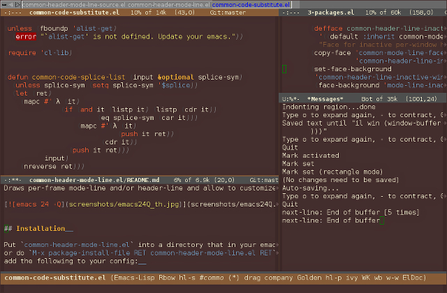

# common-header-mode-line  

## Copyright  

Copyright (C) 2017 Constantin Kulikov  

Author: Constantin Kulikov (Bad_ptr) <zxnotdead@gmail.com>  
Date: 2017/02/12 11:14:08  
License: GPL either version 3 or any later version  
Keywords: emacs, mode-line, header-line, convenience, frames, windows  
X-URL: http://github.com/Bad-ptr/common-header-mode-line.el  

## Intro  

Draws per-frame mode-line and/or header-line and allow to customize per-window header/mode-line.  

[](screenshots/emacs24Q.jpg)


## Installation  

Put `common-header-mode-line.el` into a directory that in your emacs `load-path` 
or do `M-x package-install-file RET common-header-mode-line.el RET`, 
add the following to your config:  

```elisp

    (require 'common-header-mode-line)
    (common-mode-line-mode)
    (common-header-line-mode)

```

## How to use  

`M-x customize-group RET common-heade-mode-line RET`  

`M-x customize-group RET common-mode-line RET`  

`M-x customize-group RET common-header-line RET`  


```elisp
    
    (with-eval-after-load "common-header-mode-line-autoloads"
      (add-hook
       'after-init-hook
       #'(lambda ()
           (common-mode-line-mode)
    
           (when (fboundp 'tabbar-mode)
             (common-header-line-mode)
             (copy-face 'default 'common-header-line-face)
             (set-face-background 'common-header-line-face "dim gray"))
    
           (copy-face 'common-mode-line-face
                      'common-header-line-active-window-header-line-face)
           (set-face-attribute
            'common-header-line-active-window-header-line-face
            nil :height 0.9)
    
           (setq common-header-line-per-window-format-function
                 #'(lambda (win)
                     (format-mode-line
                      '("%e" mode-line-front-space mode-line-mule-info mode-line-client
                        mode-line-modified mode-line-remote mode-line-frame-identification
                        mode-line-buffer-identification "   " mode-line-position
                        (vc-mode vc-mode)
                        "  " mode-line-misc-info mode-line-end-spaces)
                      'common-header-line-active-window-header-line-face
                      win (window-buffer win))))
    
           (setq common-mode-line-update-display-function
                 #'(lambda (display)
                     (let ((buf (cdr (assq 'buf display))))
                       (with-current-buffer buf
                         (setq-local buffer-read-only nil)
                         (erase-buffer)
                         (let*
                             ((mode-l-str
                               (format-mode-line
                                (list " "
                                      '(eldoc-mode-line-string
                                        (" " eldoc-mode-line-string " "))
                                      mode-line-buffer-identification " "
                                      mode-line-modes mode-line-misc-info mode-line-end-spaces)
                                'common-mode-line-face common-header-mode-line--selected-window))
                              (win (cdr (assq 'win display))))
                           (insert mode-l-str))
                         (setq-local mode-line-format nil)
                         (setq-local header-line-format nil)
                         (setq-local buffer-read-only t)))))
    
           (set-face-attribute
            'common-mode-line-active-window-mode-line-face
            nil :height 0.1)
           (set-face-attribute
            'common-mode-line-inactive-window-mode-line-face
            nil :height 0.3)
    
           ;; (set-face-attribute
           ;;  'common-mode-line-active-window-mode-line-face
           ;;  nil :height 0.9)
           ;; (set-face-attribute
           ;;  'common-mode-line-inactive-window-mode-line-face
           ;;  nil :height 0.8)
    
           ;; (setq common-mode-line-per-window-format-function
           ;;       #'(lambda (win)
           ;;           (format-mode-line
           ;;            '("%e" mode-line-front-space mode-line-mule-info mode-line-client
           ;;              mode-line-modified mode-line-remote mode-line-frame-identification
           ;;              mode-line-buffer-identification "   " mode-line-position
           ;;              (vc-mode vc-mode)
           ;;              "  " mode-line-misc-info mode-line-end-spaces)
           ;;            nil win (window-buffer win))))
           )))

```

Result of the above code:  
[](screenshots/emacs26custom.jpg)


## How to contribute  

Edit `common-heade-mode-line-source.el`, then run make or build.sh, 
then start `emacs -Q`, open `common-heade-mode-line.el`, `eval-buffer`, 
test how it works, if works well commit and push.  
When editing `common-heade-mode-line-source.el` using `$*` in symbol or string will 
cause the current top level form be repeated two times 
-- first time the `$*` will be replaced by `header`, second time by `mode`.  
The `$@` in symbol or string will be replaced by `header-mode`.  
